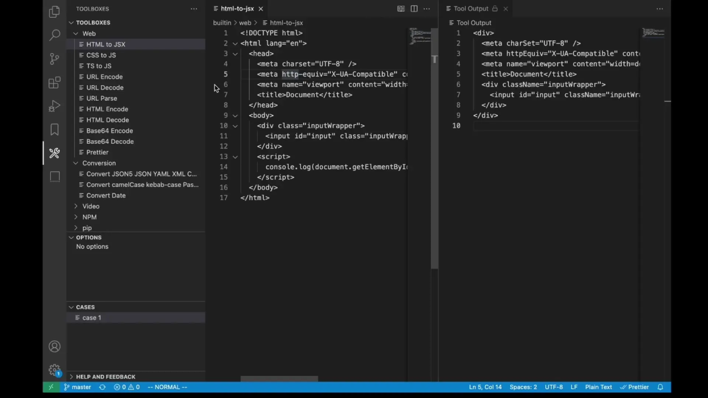

# Toolboxes

Easy to use and create various tools.


## Builtin Toolboxes



## Create Cases


## Install via CLI

```bash
code --install-extension zjffun.toolboxes
```

## Release Notes

### [TODO]

### [Unreleased]

### v0.0.8

- Fix bug broken path.

### v0.0.7

- Added features convert data support JSONString.

- Publish to Open VSX Registry.

### v0.0.6

- Added features add image, cipher and decipher tool.
- Added features add crypto, conversion and web cases.
- Added features multi-line json content.
- Fix bug show input editor first.
- Fix bug node modules version bug of vsce pack.

### v0.0.5

- Added features add TS to JS tool.
- Added features add video conversion tool.
- Added features add CSS to JS tool.
- Added features add HTML to JSX tool.

### v0.0.4

- Added features add network tools.
- Added features run commands in terminal.
- Added features convert date tool.
- Added features brew tool.
- Added features hash tool.
- Added features set pip registry tool.
- Added features convert camelCase kebab-case PascalCase tool.
- Fix bug of path sep.

### v0.0.3

- Added features builtin cases.

### v0.0.2

- Fix bug CSV TSV conversion doesn't work.

### v0.0.1

- Added features toolboxes, tool options and cases.
